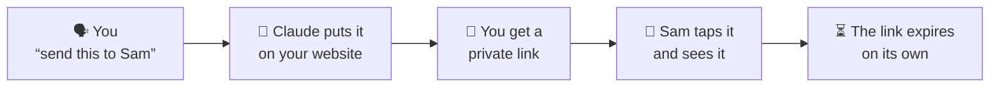
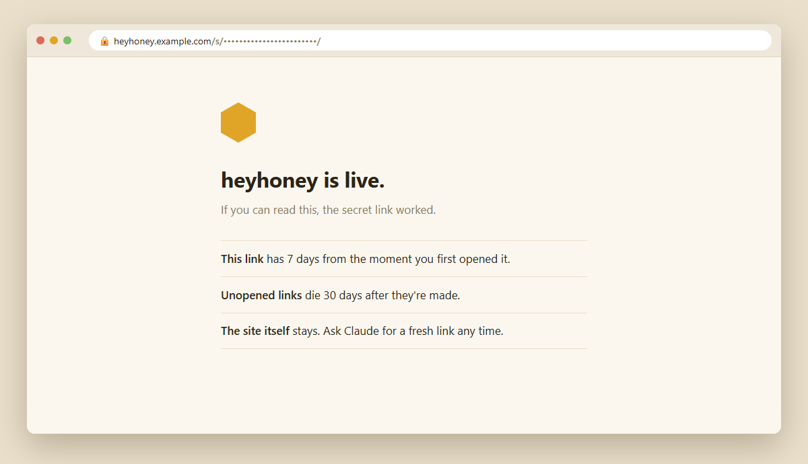
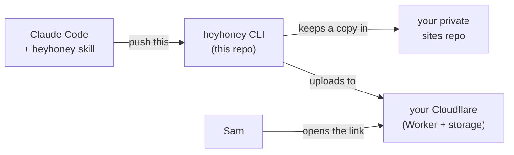
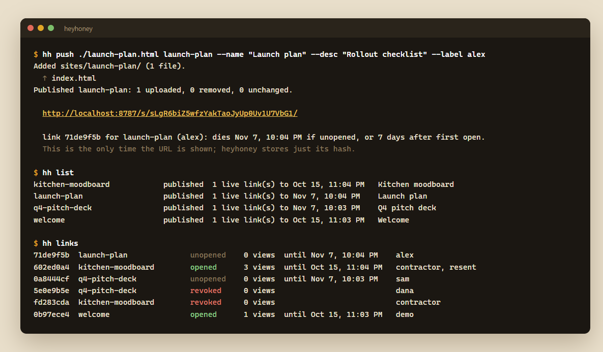
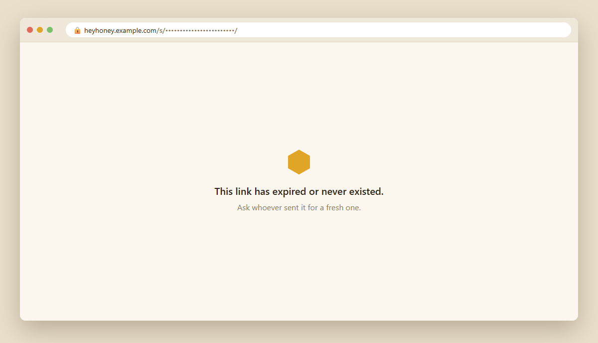
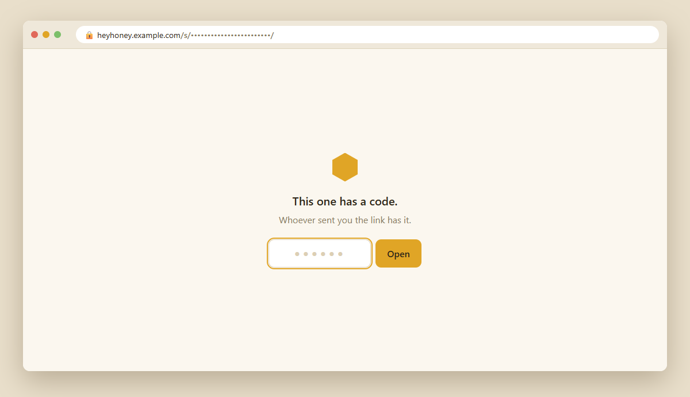

# Hey honey, look at this thing I made in Claude!

- **Host small private HTML sites to share.** Pages, dashboards, mockups, little apps: anything Claude
  makes as HTML, on your own website.
- **See who opened it, and when.** Each person gets their own secret link with their name on it, so you
  can tell that Neal opened his on Tuesday and Sam hasn't yet.
- **Links expire on their own.** Nothing to remember to take down.
- **More control than Claude's artifact hosting.** One link per person, revoke any one of them, add a
  passcode, update the page without breaking the links people already have.
- **Less exposure to other people's pages.** Only your own sites live on your domain, so you're not sharing a
  host with pages other Claude users made, or with any malware in them.

**heyhoney** lets you show the stuff you make with Claude to the people in your life, without making it
public and without making anybody sign up for anything.

You spent the evening with Claude building a budget dashboard, a floor plan for the kitchen, a trip
itinerary, a mockup for a client. Now you want your partner, your friend or your client to see it. They
don't have a Claude account. You don't want to post it on the open internet. You just want to text them a
link that works.

So you tell Claude **"send this to Sam."** Claude puts the page on your own website and gives you a private
link. Sam taps it and sees exactly what you made. A week later the link stops working by itself. Nobody had to
log in, and nothing is left lying around.





## What it does

- **Private links, no logins.** Each link is a long random address that nobody can guess. Whoever you send it
  to just taps it.
- **Links clean up after themselves.** A link stops working **7 days after it's first opened**, or after
  **30 days** if nobody opens it.
- **Your things stay yours.** Everything lives on your own domain and your own Cloudflare account (the free
  tier is plenty). No middleman service sits in between.
- **One link per person.** Send the same page to three people and each gets their own link. You can see who
  opened theirs and shut off any one without touching the others.
- **Pages stick around, links don't.** Want to show it again next month? Ask for a fresh link.
- **Optional code for sensitive things.** Add a 6-digit code that you send separately, so a forwarded link
  alone isn't enough.
- **Pages can't touch your domain.** Every page runs in a sandbox, so its code can't read your cookies or
  reach anything else on your domain. Claude warns you if a page ever needs that switched off.

## What you say to Claude

| You say | Claude does |
|---|---|
| "Push this to heyhoney for Sam" | Puts the page up and gives you Sam's link |
| "Send the kitchen plan to my contractor, with a code" | A new link plus a 6-digit code to send separately |
| "What's on heyhoney?" | Lists everything you've shared and which links are still live |
| "Did Dana open it?" | Shows who opened their link and how many times |
| "Update the dashboard" | Replaces the page; everyone's existing link shows the new version |
| "Kill Dana's link" | That link stops working right away |

## What you need

- [Claude Code](https://claude.com/claude-code)
- A Cloudflare account (free) with a domain on it. heyhoney lives on a subdomain, like `heyhoney.yourname.com`.
- About ten minutes for [setup](#setup).

---

## Under the hood

The code is this repo, and it's public. What you share lives in a **separate private repo** of your own, so
nothing personal can end up here by accident.



- **This repo (public):** a small Cloudflare Worker that serves pages, a CLI that uploads them and makes
  links, and the Claude Code skill that drives the CLI.
- **Your sites repo (private):** one folder per page you've shared, plus an `INDEX.md` catalog. It's the
  archive. Links and codes are never written to it.
- **Cloudflare:** an R2 bucket holds the files and a D1 database tracks links and expiry dates. The Worker is
  the only part on the internet, and all it does is read.
- **The skill:** `skill/SKILL.md` is a template. `install-skill` fills in your paths and domain and writes
  the copy Claude Code loads (`~/.claude/skills/heyhoney/SKILL.md`).



### How a request is served

```
 browser ──▶ Worker (src/index.ts) on your subdomain
   /s/<token>/<path>          → sha256(token) → links ⋈ sites → live? → pin unlocked? → wrapper page
   /s/<token>/~<key>/<path>   → (inside the wrapper's sandboxed frame) → R2 <slug>/<path>
```

- **Not Cloudflare Pages.** Pages serves static files publicly, so anyone could reach them without a link.
  Here the files sit in a private R2 bucket, and the Worker serves only what a live token grants.
- **No upload endpoint.** The CLI writes R2 and D1 with your own `wrangler login`. The Worker is read-only and
  holds no admin secret, so there's nothing to brute-force.
- **The clock.** Minting sets `expires_at = now + 30d`. The first real open sets `expires_at = now + 7d`. A real
  open is a top-level GET of the site's entry page from a non-bot user agent.
- **Link previews are safe.** Slack, iMessage, Discord and other unfurlers get a blank stub, so pasting a link
  into chat neither leaks the content nor starts the clock.
- **Headers.** `Cache-Control: private, no-store`, `X-Robots-Tag: noindex`, and `Referrer-Policy: no-referrer`,
  so the token never leaks to a CDN through the Referer header. `robots.txt` disallows everything, and there is
  no `workers.dev` or preview hostname.
- **Updates keep links.** `publish` uploads only changed files and deletes removed ones. Everyone holding a
  link sees the new version.
- **Cron** (daily) drops link rows that have been dead for 60 days. Sites are never deleted automatically.



### The sandbox (on by default)

Every page you share runs on your domain, so without protection its JavaScript could read cookies for
`yourname.com`, set cookies that your other subdomains trust, or poke at other heyhoney pages. heyhoney
doesn't let it.

- **A wrapper at the top.** The link serves a tiny page of ours whose only content is a full-window
  `<iframe sandbox>` without `allow-same-origin`. The site runs in that frame with a `null` origin: no cookies,
  no storage, no same-origin access to anything. The wrapper itself runs no script, and nobody else can frame it.
- **The frame's own URL** is `/s/<token>/~<key>/…`, where `<key>` is the link's unlock key for pinned links
  (empty otherwise). The page's own fetches, modules and fonts work, because the files carry
  `Access-Control-Allow-Origin: *` and the key travels in the path rather than in a cookie, which a `null`
  origin wouldn't send. The address bar only ever shows the plain link.
- **Belt and braces.** Every file is also served with `Content-Security-Policy: sandbox …`, so opening one
  directly in a tab (an SVG, say) is sandboxed too.
- **What breaks:** `localStorage`, `sessionStorage`, IndexedDB, `document.cookie`, service workers, camera,
  mic and location. `publish` scans each site for these and prints a warning. The skill tells Claude to fix
  the page first (a `try/catch` fallback is usually enough), and to explain the risk and ask you before ever
  running `heyhoney sandbox <slug> off`. Unsandboxed sites are flagged in `list` and `INDEX.md`.

### Codes (pins), for the odd sensitive share

The default is a plain link, one tap. For anything you'd mind being forwarded, add `--pin`:

```bash
node bin/heyhoney.mjs link pitch-deck "dana" --pin          # makes a 6-digit code
node bin/heyhoney.mjs link pitch-deck "dana" --pin=4821     # or choose one
```

The link then opens a code page first. Send the code another way (a different app, or say it out loud), so a
leaked or forwarded link isn't enough on its own.



- **Once per browser.** The right code sets an `HttpOnly`, `Secure` cookie scoped to that one link's path. It
  holds a random per-link key, so it can't be forged and doesn't unlock any other link.
- **Ten wrong codes revoke the link.** A 6-digit code has a million values, and ten guesses won't find it.
  `links` shows how many wrong tries each pinned link has taken.
- **Only hashes are stored.** Like the URL, the code is printed once, when the link is made.
- **The clock starts on unlock**, not when someone lands on the code page.

## Setup

You need a Cloudflare account (the free tier is plenty) with a domain on it, and Node 20+.

```bash
git clone https://github.com/NTBooks/heyhoney && cd heyhoney
npm install
npx wrangler login
npx wrangler d1 create heyhoney          # note the printed database_id
npx wrangler r2 bucket create heyhoney
```

Copy `wrangler.jsonc` to `wrangler.local.jsonc` (git-ignored, so your domain stays out of any fork you push) and
set `routes[0].pattern` to your subdomain and `database_id` to yours. The CLI and npm scripts use the local file.
Then:

```bash
npm run db:migrate
npm run deploy
```

Keep your content out of this repo. Make a private repo for it and point the CLI at its `sites/` folder:

```bash
git init ../heyhoney-sites && mkdir ../heyhoney-sites/sites
echo '{ "sites": "../heyhoney-sites/sites" }' > heyhoney.local.json   # git-ignored
node bin/heyhoney.mjs install-skill     # writes ~/.claude/skills/heyhoney/SKILL.md with your paths
```

## CLI

```
node bin/heyhoney.mjs push <file|dir> <slug> --name "Title" --desc "What it is" --label "for whom"
node bin/heyhoney.mjs list                 # the index: sites, publish state, live links
node bin/heyhoney.mjs link <slug> "label"  # a fresh link for an existing site (add --pin for a code)
node bin/heyhoney.mjs links [slug]         # every link: unopened, opened, expired, revoked, views
node bin/heyhoney.mjs revoke <link-id|slug>
node bin/heyhoney.mjs publish <slug>       # after editing a site folder (changed files only)
node bin/heyhoney.mjs sandbox <slug> on|off  # isolation is on by default; off only for trusted code
node bin/heyhoney.mjs unpublish <slug>
```

A lone `.html` file becomes `index.html`. A folder keeps its layout, so relative CSS, JS and images work. Add
`--local` to any command to target `npm run dev` (wrangler dev on :8787) instead of production. The
screenshots above came from exactly that.

## Limits

- Anyone holding a live link (and its pin, if it has one) can read every file in that site. Don't put secrets
  in one.
- Corporate mail scanners that open links in a real browser can count as the first open.
- Sandboxed pages can't remember anything between visits (no `localStorage`). That's the price of isolation;
  turn the sandbox off per site only for code you trust.
- Uploads run one wrangler call per file, four at a time. A big folder is slow the first time and fast after,
  because unchanged files are skipped.
