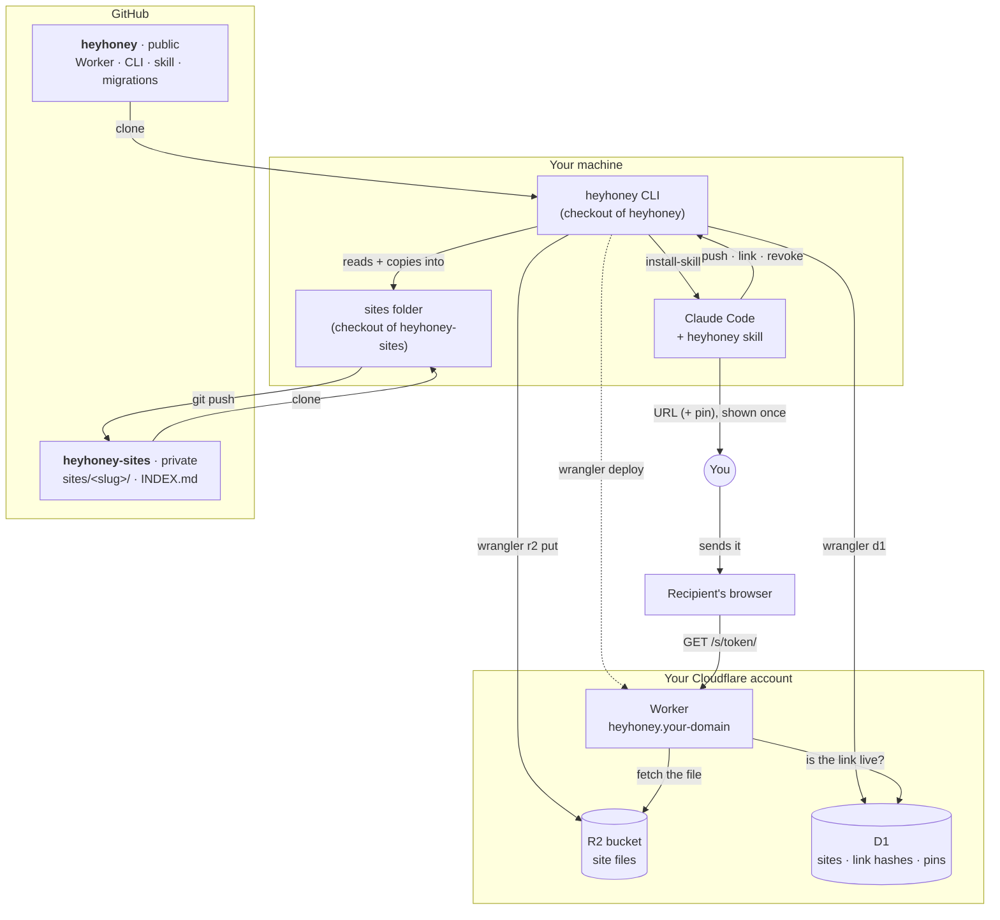

# heyhoney

Your own private Claude Artifacts. Claude builds a page, pushes it to a Cloudflare Worker on your domain, and
hands you a secret link. No logins. Links expire on their own: **30 days after they're made if nobody opens
them, or 7 days after the first open.** The page stays, so you can mint a fresh link whenever you want to
share it again.


- **Sites** are permanent. Each is a folder with a `site.json`, kept in a separate private git repo (the
  archive), and mirrored to an R2 bucket.
- **Links** look like `https://heyhoney.example.com/s/<token>/`, one per recipient, each labelled with who it's
  for. Only a hash of the token is stored, so the URL is shown exactly once, when it's made.
- **Claude drives it** through a Claude Code skill. Say "push this to heyhoney for Sam", "new link for the
  pitch deck", "what's on heyhoney" or "kill Dana's link".


## The system

Two repos, one machine, one Cloudflare account. The code is public (this repo). Your content lives in a
private repo of its own, so nothing you share can ever end up here by accident.



- **Public repo (this one):** the Worker, the CLI, the skill template, and the D1 migrations. It knows your
  subdomain and nothing else.
- **The skill:** `skill/SKILL.md` is a template with `{{SITES}}`-style placeholders. `install-skill` fills in
  your paths and domain and writes the copy Claude Code loads, `~/.claude/skills/heyhoney/SKILL.md`. Edit the
  template, then run `install-skill` again.
- **Private repo (`heyhoney-sites`):** one folder per site plus `INDEX.md`, the catalog Claude reads. It's the
  archive: if Cloudflare vanished, `publish` would rebuild everything from here. Link URLs and pins are
  never written to it.
- **Cloudflare:** R2 holds a copy of each site's files, and D1 holds the catalog plus token and pin hashes.
  The Worker is the only thing on the internet, and it only reads.

## How it works

```
 browser ──▶ Worker (src/index.ts) on your subdomain
             /s/<token>/<path> → sha256(token) → links ⋈ sites → live? → pin unlocked? → R2 <slug>/<path>
```

- **Not Cloudflare Pages.** Pages serves static files publicly, so anyone could reach them without a link.
  Here the files sit in a private R2 bucket, and the Worker serves only what a live token grants.
- **No upload endpoint.** The CLI writes R2 and D1 with your own `wrangler login`. The Worker is read-only and
  holds no admin secret, so there's nothing to brute-force.
- **The clock.** Minting sets `expires_at = now + 30d`. The first real open sets `expires_at = now + 7d`. A real
  open is a top-level GET of the site's entry page from a non-bot user agent.
- **Link previews are safe.** Slack, iMessage, Discord and other unfurlers get a blank stub, so pasting a link
  into chat neither leaks the content nor starts the clock.
- **Headers.** `Cache-Control: private, no-store`, `X-Robots-Tag: noindex`, and `Referrer-Policy: no-referrer`,
  so the token never leaks to a CDN through the Referer header. `robots.txt` disallows everything, and there is
  no `workers.dev` or preview hostname.
- **Updates keep links.** `publish` uploads only changed files and deletes removed ones. Everyone holding a
  link sees the new version.
- **Cron** (daily) drops link rows that have been dead for 60 days. Sites are never deleted automatically.


## Pins, for the odd sensitive share

The default is a plain link, one tap. For anything you'd mind being forwarded, add `--pin`:

```bash
node bin/heyhoney.mjs link pitch-deck "dana" --pin          # makes a 6-digit code
node bin/heyhoney.mjs link pitch-deck "dana" --pin=4821     # or choose one
```

The link then opens a code page first. Send the code another way (a different app, or say it out loud), so a
leaked or forwarded link isn't enough on its own.


- **Once per browser.** The right code sets an `HttpOnly`, `Secure` cookie scoped to that one link's path. It
  holds a random per-link key, so it can't be forged and doesn't unlock any other link.
- **Ten wrong codes revoke the link.** A 6-digit code has a million values, and ten guesses won't find it.
  `links` shows how many wrong tries each pinned link has taken.
- **Only hashes are stored.** Like the URL, the code is printed once, when the link is made.
- **The clock starts on unlock**, not when someone lands on the code page.

## Setup

You need a Cloudflare account (the free tier is plenty) with a domain on it, and Node 20+.

```bash
git clone https://github.com/NTBooks/heyhoney && cd heyhoney
npm install
npx wrangler login
npx wrangler d1 create heyhoney          # put the printed database_id in wrangler.jsonc
npx wrangler r2 bucket create heyhoney
```

Edit `wrangler.jsonc`: set `routes[0].pattern` to your subdomain and `database_id` to yours. Then:

```bash
npm run db:migrate
npx wrangler deploy
```

Keep your content out of this repo. Make a private repo for it and point the CLI at its `sites/` folder:

```bash
git init ../heyhoney-sites && mkdir ../heyhoney-sites/sites
echo '{ "sites": "../heyhoney-sites/sites" }' > heyhoney.local.json   # git-ignored
node bin/heyhoney.mjs install-skill     # writes ~/.claude/skills/heyhoney/SKILL.md with your paths
```

## CLI

```
node bin/heyhoney.mjs push <file|dir> <slug> --name "Title" --desc "What it is" --label "for whom"
node bin/heyhoney.mjs list                 # the index: sites, publish state, live links
node bin/heyhoney.mjs link <slug> "label"  # a fresh link for an existing site (add --pin for a code)
node bin/heyhoney.mjs links [slug]         # every link: unopened, opened, expired, revoked, views
node bin/heyhoney.mjs revoke <link-id|slug>
node bin/heyhoney.mjs publish <slug>       # after editing a site folder (changed files only)
node bin/heyhoney.mjs unpublish <slug>
```

A lone `.html` file becomes `index.html`. A folder keeps its layout, so relative CSS, JS and images work. Add
`--local` to any command to target `npm run dev` (wrangler dev on :8787) instead of production. The
screenshots above came from exactly that.

## Limits

- Anyone holding a live link (and its pin, if it has one) can read every file in that site. Don't put secrets
  in one.
- Corporate mail scanners that open links in a real browser can count as the first open.
- Uploads run one wrangler call per file, four at a time. A big folder is slow the first time and fast after,
  because unchanged files are skipped.
